# Game Of Thrones Quiz

The Game Of Thrones Quiz has been designed to be a fun test of knowledge for any fans of the show. Users will be able to see feedback right away on which question they got right and if they have chosen a wrong answer, it will show them the correct one.

The live link to the Github repository can be found here - (https://mushbt.github.io/got-quiz/)

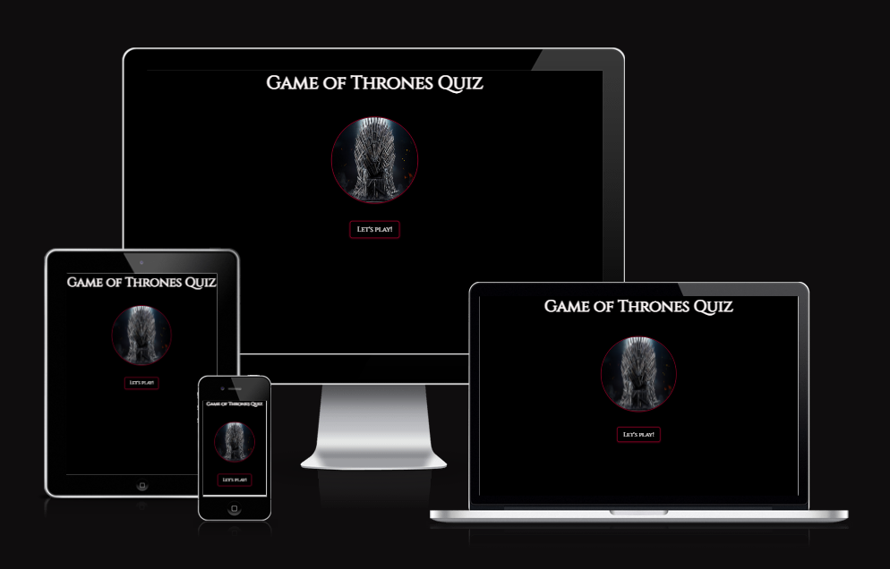

# Contents

* [**User Experience UX**](<#user-experience-ux>)
    * [User Stories](<#user-stories>)
    * [Wireframes](<#wireframes>)
    * [Site Structure](<#site-structure>)
    * [Design Choices](<#design-choices>)
    * [Typography](<#typography>)
    * [Colour Scheme](<#colour-scheme>)
* [**Features**](<#features>)
    * [Home](<#home-page>)
    * [Game](<#Game>)
    * [End](<#End>)
* [**Future Features**](<#future-features>)
* [**Technologies Used**](<#technologies-used>)
* [**Testing**](<#testing>)
* [**Deployment**](<#deployment>)
* [**Credits**](<#credits>)
* [**Content**](<#content>)
* [**Media**](<#media>)
* [**Acknowledgements**](<#acknowledgements>)

# User Experience (UX)

## User Stories

* As a user, I want to know what the website is about as soon as I enter the site.
* As a user, I want to be able easily enter the game page.
* As a user, I want to be able to play the game and test my knowledge in a fun and simple way.
* As a user, I want to be able to see if my answer is correct.
* As a user, I want to be able to see if my answer is incorrect.
* As a user, I want to see what was the correct answer if I have chosen an incorrect answer.
* As a user, I want to know what my score is.
* As a user, I want to know how many questions I have left to complete quiz.
* As a user, I want to be able to play the game again.

[Back to top](<#Contents>)

## Wireframes

The wireframes for The Game of Thrones Quiz were produced in [Balsamiq](https://balsamiq.com). There are frames for a full width display, an Ipad device and a small mobile device. The final site varies a little due to some changes being made during development.

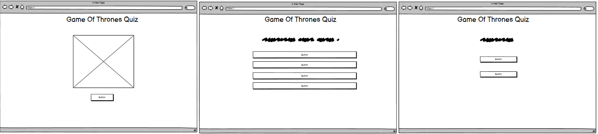

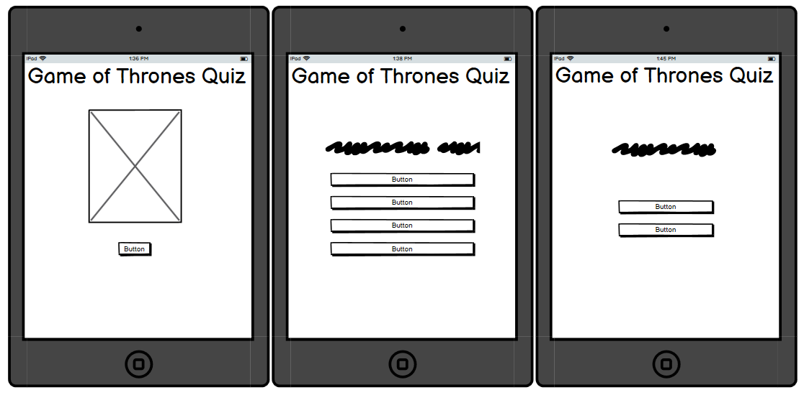

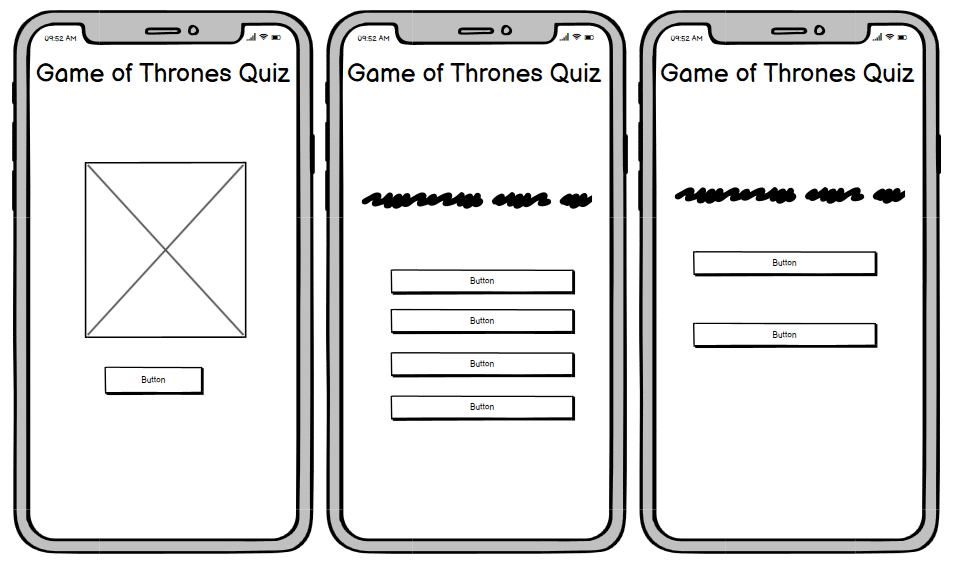

[Back to top](<#Contents>)

## Site Structure

When entering the site, users will be on the [home page](index.html) which is the Landing page. There is a 'Lets Play' button which users can click to enter the [game page](game.html). Once on the game page, users will be faced with the first question from the quiz. Everytime they click on an answer, the next question will load. Once 10 questions have been answered, they will be redirected to the [end page](end.html). On the end page, they will see their total score and have the option to either play again which will reload the quiz, or, they can go home which will redirect them to the home page.

[Back to top](<#Contents>)

## Design Choices

* ### Typography
    * The font chosen was 'Cinzel'. I chose this font because it was the closest font to the original Game of Thrones font. Cinzel falls back to to serif.
    Cinzel is an easy on the eye type of font and is easy to read.

* ### Color Scheme
     The color scheme was chosen based on the colors from one of the original Game of Thrones logos. The colors were black and white, but decided to use the color snow instead of white with reference to 'Jon Snow' who was a main character on the show. I added details of Burgundy because I thought it would complement the main colors of Black and White. The reason burgundy was chosen was because after some research online, I found that burgundy was the most used shade of color throught the show.

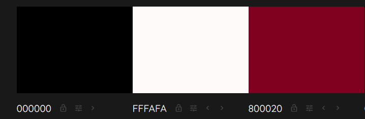     
     
[Back to top](<#contents>)

# Features

The Game of Thrones quiz was made to be simple and easy to play. The thought behind this was that users should not be overwhelmed with complicated instructions or navigation. It should be a simple fun quiz which does not require any effort to play it.

* ### Home

    * This is the landing page, where potential visitors will come to once they have entered the site. I have chosen an image with 'The Iron Throne' which is what the original Game of Thrones series is about.
    * Users will the see the page title (The Game of Thrones Quiz) at the top which is self-explanatory.
    * Under the image, there is a 'Lets Play' button which will take them to the main game.

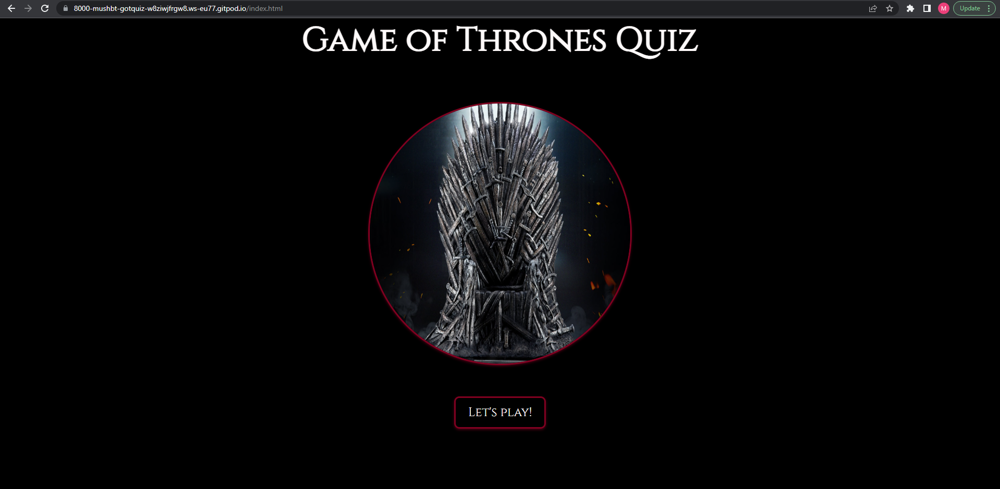
[back to top](<#contents>) 

* ### Game

    * This is the game page, where the user will be able to play the quiz.
    * At the top of the page, the game title is still visible.
    * Just under the title, there is a heads up display (HUD) which will show the user information on how many questions they have answered out of 10, and also how many points they have been awarded.
    * Under the HUD, users will see the first question and 4 possible choices from which they can choose 1 from. A new question will load everytime they have chosen an answer.

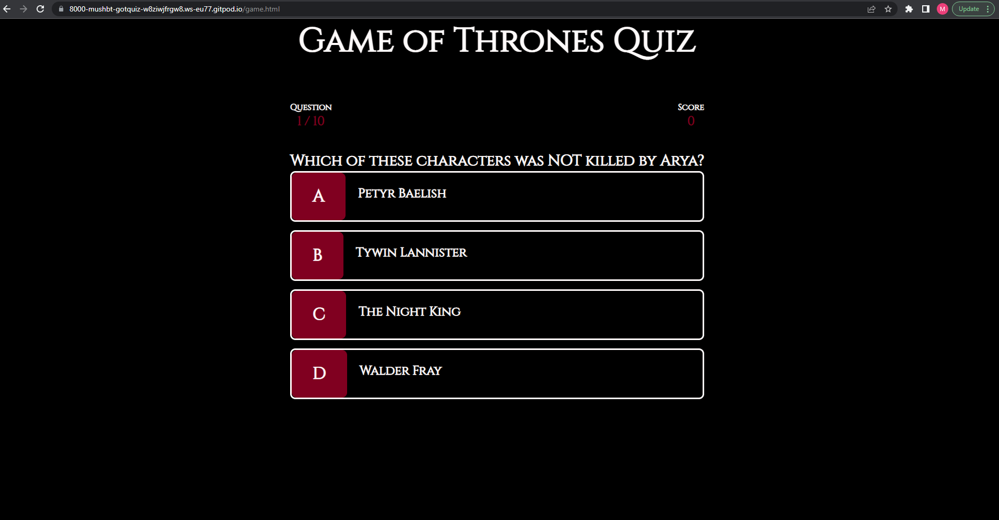
[back to top](<#contents>)

* ### End

    * This is the end page, where users will be redirected after answering a total of 10 questions.
    * At the top of the page, the title is still visible.
    * Users will see their final score.
    * There are 2 buttons which the user can choose from. One is to play again, which will reload the game, and the other is to go home, redirecting the user to the home page.

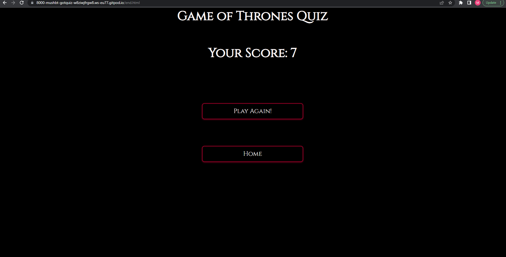
[back to top](<#contents>)

## Future Features 

* A high-score section where users can submit their scores and also see other users scores.
* Background music which will be the game of thrones theme tune.
* A link to other quizes, which will fall under the Game of Thrones theme such as, a 'House of Dragons Quiz' based on the new series which is a prequel from the original show.

[back to top](<#contents>)

# Technologies Used
* [HTML5](https://www.w3schools.com/html/) - Used for the content and structure of the site.
* [CSS](https://www.w3schools.com/css/) - Used for styling the site.
* [JS](https://www.w3schools.com/JS/) - Used to program the behavior of the site. 
* [Balsamiq](https://balsamiq.com/wireframes/) - Used to create the wireframes.
* [Gitpod](https://www.gitpod.io/#get-started) - Used to deploy the website.
* [Github](https://github.com/) - Used to host and edit the website.

[Back to top](<#contents>)

# Testing
## Code Validation
The Stockholm FC site has been tested in depth. All the code has been run through the [W3C html Validator](https://validator.w3.org/), [W3C CSS Validator](https://jigsaw.w3.org/css-validator/) and the [JSHint Validator](https://jshint.com/).  

The HTML validator results for each page are below:

* Home page

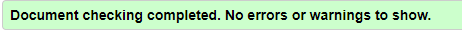

* Game page

* End page

The CSS validator results for each page are below:

* Home page

* Game page 

* End page 

### JSHint
 * The Javascript files were validated through JSHint. There were multiple warnings for: ES6 (use 'esversion: 6') or Mozilla JS extensions (use moz). After some research online, I saw that I need to add /*jshint esversion: 6 */ on the top of the JS file and the warning will disappear. I also had a few warnings for missing semi-colans which have also been rectified. There were some unresolved warnings which have been listed below in the [Unresolved](#unresolved) section.

## Responsiveness Test

* The responsive design tests were done using [Google Chrome DevTools](https://developer.chrome.com/docs/devtools/) and [Responsive Design Checker](https://www.responsivedesignchecker.com/) which allows you to test the site on numerous devices which range from desktop screens to mobile phones.
* Site link was sent to friends and family and also posted on the Slack portal.

## Browser Compatibility

The Game of Thrones Quiz was tested on the following browsers:
Google Chrome, Microsoft Edge, Safari, Mozilla Firefox, Samsung Internet, and Huawei Browser.
No visible errors occured.

## Testing User Stories

* As a user, I want to know what the website is about as soon as I enter the site.
   * A title of Game of Thrones Quiz visible at the top of the page.
   * An image of the 'Iron Throne' has been placed in the middle of the page.

    
* As a user, I want to be able easily enter the game page.
   * A 'Lets Play' button has been placed under the image which will take the user to the game page once clicked.
   * The button is responsive so that users know it is clickable.

    
* As a user, I want to be able to play the game and test my knowledge in a fun and simple way.
   * Once on the game page, the user will see the first question with 4 multiple choice answers. Once user has chosen their answer, the next question will load.
   * All choice buttons are responsive so that users know they are clickable.

    
* As a user, I want to be able to see if my answer is correct.
   * If the answer chosen by the user is correct, the choice button will turn green.

    
* As a user, I want to be able to see if my answer is incorrect.
   * If the answer chosen by the user is incorrect, the choice button will turn red.

    
* As a user, I want to see what was the correct answer if I have chosen an incorrect answer.
   * If the answer chosen by the user is incorrect, the choice button they chose will turn red and the correct answer will turn green.

    
* As a user, I want to know what my score is.
   * On the top of the quiz, there is HUD which shows how many points they have received for the correct answers. Points go up by 1 point per correct answer.
   * On the end page, the user can see their final score.

    
* As a user, I want to know how many questions I have left to complete quiz.
   * On the top of the quiz, there is a HUD which shows the user how many questions of 10 they have answered. 10 being the maximum amount of questions they can answer per game.

    
* As a user, I want to be able to play the game again.
   * On the end page, the user has the option to play the game again by clicking on the button 'Play Again'.

## Known Bugs
* ### Resolved

   * During validation, a few errors where highlighted. A brief decription is below:

   * HTML - 
      * Game page
   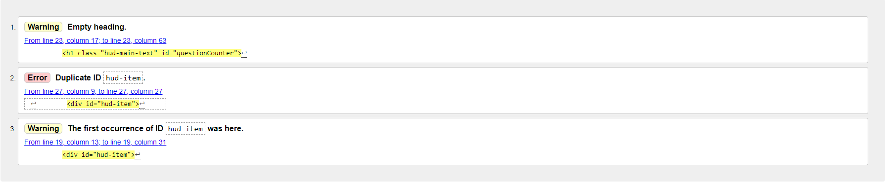
      * Warning 1 showed an empty heading. This was resolved by adding a heading text to the h1 element.
      * Warning 2 and 3 was resolved by removing the dash between hud and item.

      * End page
   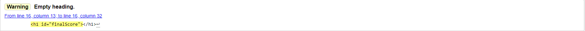
      * The warning showed an empty heading. This was resolved by adding a heading text to the h1 element.

* ### Unresolved
   * JS - 
     
      * Game page
     

      * End page
   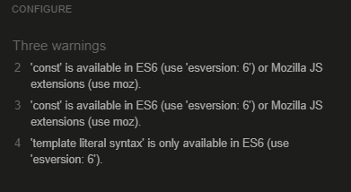

## Additional Testing
### Lighthouse
The site was tested using [Google Lighthouse](https://developers.google.com/web/tools/lighthouse) in Chrome Developer Tools to test the pages for the following:
* Performance - How the page performs whilst loading.
* Accessibility - Is the site acccessible for all users and how can it be improved.
* Best Practices - Site conforms to industry best practices.
* SEO - Search Engine Optimisation. Is the site optimised for search engine result rankings.

* The results for the tests are below:
* Home page- 

* Game page -

* End page -

# Deployment

### **To deploy the project**
The site was deployed to GitHub pages. The steps to deploy the site are as followed:
  1. In the GitHub repository, navigate to the **Settings** tab.
  2. Once in Settings, navigate to the **Pages** tab on the left-hand side.
  3. Under **Source**, select the branch to **main**, then click **save**.
  4. Once the main branch has been selected, the page will be automatically refreshed with a detailed ribbon display to indicate the successful deployment.

  The live link to the Github repository can be found here - (insert link here)

### **To fork the repository on GitHub**
A copy of the GitHub Repository can be made by forking the GitHub account. This copy can be viewed and changed without affecting the original repository. The steps to fork the repository are as followed:
1. Log in to **GitHub** and locate the [repository](insert link here).
2. On the right hand side of the page inline, there should be a button called **'Fork'**, click on the button to create a copy of the original repository in your GitHub Account.

### **To create a local clone of this project**
The steps to create a local clone of this project are as followed:
1. Under the repository’s name, click on the **code** tab.
2. In the **Clone with HTTPS** section, click on the clipboard icon to copy the given URL.

3. In your IDE of choice, open **Git Bash**.
4. Change the current working directory to the location where you want the cloned directory to be made.
5. Type **git clone**, and then paste the URL copied from GitHub.
6. Press **enter** and the local clone will be created.

[Back to top](<#contents>)

# Credits
### Content

* The fonts came from [Google Fonts](https://fonts.google.com/).
* The colors were chosen based on colors seen in the original Game of Thrones.[Game of Thrones](https://www.imdb.com/title/tt0944947/).
* [Balsamiq](https://balsamiq.com/wireframes/) was used to create the wireframes.
* Gitpod Template for the project was generated from [Code Institute](https://codeinstitute.net/)
* [James Q Quick tutorial for building a quiz app](https://www.youtube.com/watch?v=u98ROZjBWy8&list=PLDlWc9AfQBfZIkdVaOQXi1tizJeNJipEx&ab_channel=JamesQQuick)

### Media 

* The Iron Throne image was taken from [Big Bad Toy Store](https://www.bigbadtoystore.com/Product/VariationDetails/183962) - Image found on google images.

[Back to top](<#contents>)

# Acknowledgements
The site was done as part of a project piece for my Full Stack Software Development Diploma at the [Code Institute](https://codeinstitute.net/).
I would like to thank my mentor [Precious Ijege](https://www.linkedin.com/in/precious-ijege-908a00168/) for all his advice and help throughout. I would like to also thank the Slack community and the tutors at The Code Institute for their help whenever it was needed.

The idea for my quiz game was inspired by watching the original Game of Thrones and there was no copyright infringement intended.

Mustafa Habet 2022.

[Back to top](<#contents>)